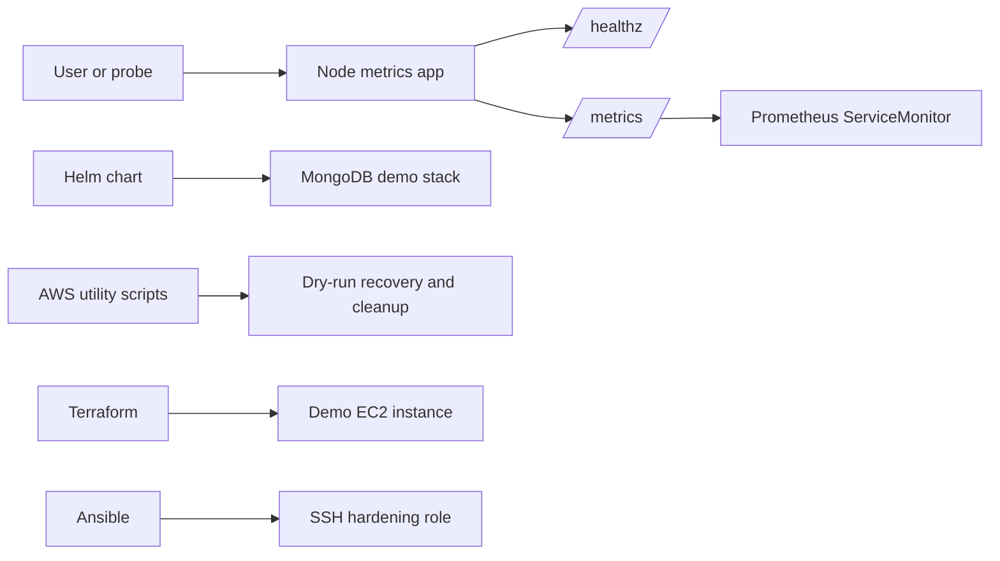

# Self-Healing Microservices Cluster

[](https://github.com/h-vance/self-healing-microservices-cluster/actions/workflows/terraform.yml)
[](https://www.python.org/)
[](https://nodejs.org/)
[](https://prometheus.io/)
[](https://redis.io/)
[](https://www.terraform.io/)
[](https://www.ansible.com/)
[](https://aws.amazon.com/)
[](https://www.docker.com/)

Demo infrastructure for a monitored Kubernetes workload with Prometheus metrics, Helm rendering, Terraform validation, Ansible hardening, and dry-run AWS recovery utilities.

This repo is built for portfolio review: it shows production-aware patterns without pretending to be a complete production platform.

## What This Demonstrates

- A testable Node.js metrics service with `/healthz`, `/`, and `/metrics`.
- Kubernetes manifests with probes, resource controls, and basic security contexts.
- A Helm chart for rendering the MongoDB and mongo-express demo stack.
- Terraform that validates a small AWS EC2 example without requiring backend state.
- Python AWS utilities that default to dry-run behavior before cloud mutation.
- CI that checks Node tests, Helm, Terraform, and formatting.

## Architecture



For deeper system notes, see [docs/architecture.md](docs/architecture.md).

## Quickstart

Run from the repository root unless a command changes directories.

| Task | Command |
| --- | --- |
| Install Node deps | `cd node-metrics-app && npm ci` |
| Test metrics app | `cd node-metrics-app && npm test` |
| Run metrics app | `cd node-metrics-app && PORT=3000 npm start` |
| Build container | `cd node-metrics-app && docker build -t node-metrics-app:local .` |
| Lint Helm chart | `helm lint mongo-stack` |
| Render Helm chart | `helm template mongo-stack mongo-stack` |
| Check Terraform formatting | `terraform fmt -check -recursive` |
| Validate Terraform | `cd terraform && terraform init -backend=false && terraform validate` |

## Prerequisites

| Tool | Used for |
| --- | --- |
| Node.js 22 and npm | Metrics app tests and local server |
| Docker | Local image build |
| Helm | Chart linting and rendering |
| kubectl | Applying manifests to a cluster |
| Terraform >= 1.5 | AWS example validation |
| Python 3 | AWS and Ansible helper scripts |
| AWS credentials | Only required for live AWS API calls |
| Ansible | SSH hardening playbook |

## Repository Map

| Path | Purpose |
| --- | --- |
| `node-metrics-app/` | Express metrics service, Dockerfile, Kubernetes service, and tests |
| `k8s/` | Standalone Kubernetes examples for alerts, RBAC, MongoDB, and demo workloads |
| `mongo-k8s/` | Alternate standalone MongoDB and mongo-express manifests |
| `mongo-stack/` | Helm chart for the MongoDB demo stack |
| `terraform/` | Validation-friendly AWS EC2 example |
| `scripts/` | AWS backup, cleanup, restore, tagging, health, and recovery utilities |
| `ansible/` | SSH hardening role and fleet utility examples |
| `assets/` | Existing project SVG assets |
| `aws-bedrock-agent/` | Placeholder directory for future agent work |
| `terraform-landing-zone/` | Placeholder directory for future landing-zone work |

`node-metrics-app/service-monitor.yaml` is the canonical ServiceMonitor example. `service-monitor.yml` is a duplicate legacy filename kept for compatibility.

## Configuration

Copy `.env.example` when running local scripts that read environment variables. Full details live in [docs/configuration.md](docs/configuration.md).

AWS utility scripts are safe by default. Commands that can mutate cloud resources require `--execute`.

```bash
python3 scripts/monitor.py --url https://example.com
python3 scripts/backup.py --region us-east-1
python3 scripts/cleanup.py --older-than-days 30
python3 scripts/restore.py --snapshot-id snap-123 --instance-id i-123 --availability-zone us-east-1a
python3 scripts/add_tags.py --key Environment --value Dev
```

## Documentation

- [Architecture](docs/architecture.md)
- [Runbooks](docs/runbooks.md)
- [Configuration](docs/configuration.md)
- [Portfolio Scope](docs/portfolio-scope.md)

## Safety Notes

- The checked-in Kubernetes Secret values are placeholders. Replace them before applying manifests to a real cluster.
- Do not place real credentials in manifests, `.env` files, command history, or documentation.
- MongoDB examples are demo deployments. They do not include persistent volumes, network policies, external secret delivery, or high availability.
- Terraform is intentionally minimal and does not create a VPC, EKS cluster, IAM boundary, or observability stack.

## Known Limitations

- No live cluster end-to-end test is included.
- No production secret manager is wired in.
- MongoDB has no persistent storage in the demo manifests.
- Docker image tags such as `w0nky/my-node-metrics:1.0.0` assume the image has been built and published under that tag.
