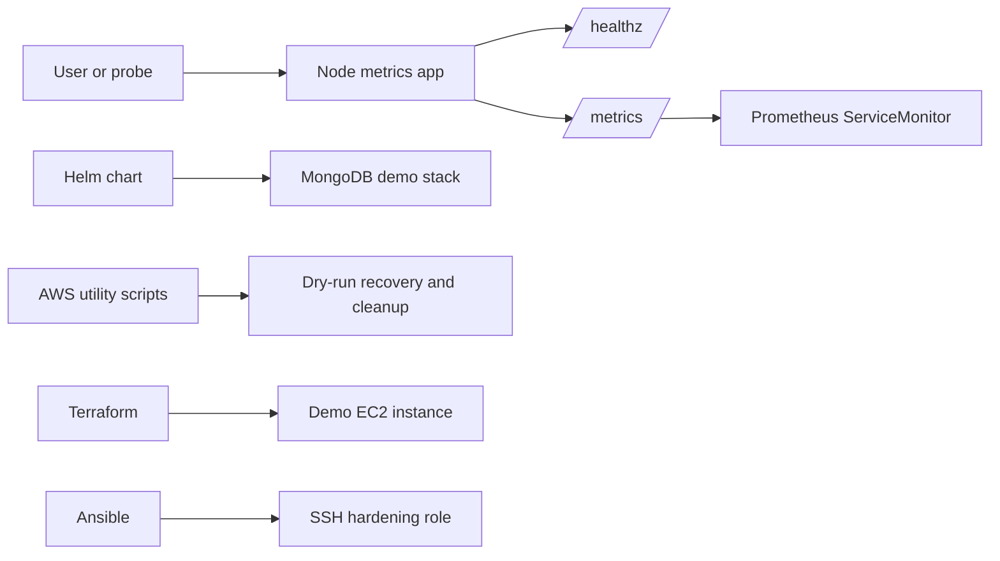

# Self-Healing Microservices Cluster

[](https://github.com/h-vance/self-healing-microservices-cluster/actions/workflows/ci.yml)
[](https://www.python.org/)
[](https://nodejs.org/)
[](https://prometheus.io/)
[](https://redis.io/)
[](https://www.terraform.io/)
[](https://www.ansible.com/)
[](https://aws.amazon.com/)
[](https://www.docker.com/)

A monitored Kubernetes workload that recovers from injected faults on its own,
with the recovery asserted in CI against a real cluster rather than described
in a README.

This repo is built for portfolio review: it shows production-aware patterns
without pretending to be a complete production platform. What is and is not in
scope is stated plainly in [docs/portfolio-scope.md](docs/portfolio-scope.md).

## What This Demonstrates

- **Self-healing that is tested, not asserted.** Every push creates a `kind`
  cluster, injects three real faults, and fails the build if the workload does
  not recover. See [docs/evidence/](docs/evidence/) for captured runs.
- **A remediation controller** that receives Alertmanager webhooks and performs
  scoped `kubectl` actions, capturing deployment state before and after so the
  remediation is provable. Least-privilege RBAC: read pods, patch deployments.
- Resilience primitives applied to a running workload: HorizontalPodAutoscaler,
  PodDisruptionBudget, NetworkPolicy, probes, resource limits, security
  contexts.
- A testable Node.js metrics service with `/healthz`, `/`, and `/metrics`, plus
  fault-injection routes gated behind `CHAOS_ENABLED`.
- A Helm chart for rendering the MongoDB and mongo-express demo stack.
- Terraform that validates a small AWS EC2 example without requiring backend
  state.
- CI that checks Node tests, Helm, Terraform, and formatting.

## Chaos Scenarios

| Scenario | Fault | Recovery mechanism | Observed |
|---|---|---|---|
| [liveness](docs/evidence/liveness.md) | `/healthz` forced to 503 | kubelet restarts the container | restart after 84s |
| [oom](docs/evidence/oom.md) | allocation past the 128Mi limit | kubelet OOM-kills and restarts | `OOMKilled`, under 3s |
| [pod-delete](docs/evidence/pod-delete.md) | `kubectl delete pod` | Deployment controller replaces it | Ready after 33s |
| [remediation-loop](docs/evidence/remediation-loop.md) | same liveness fault | Prometheus alert routed to the controller | remediated in 40.9s |

Run one locally against any cluster:

```bash
bash scripts/chaos.sh liveness
```

The assertions are scoped to a single named pod and each scenario waits for a
settled cluster first, so a restart from an unrelated cause cannot make a
scenario pass. Removing the `livenessProbe` makes the liveness scenario fail,
which is the control that makes a passing run mean something.

## Architecture


```mermaid
flowchart LR
    User[User or probe] --> App[Node metrics app]
    App --> Health[/healthz/]
    App --> Metrics[/metrics/]
    Metrics --> ServiceMonitor[Prometheus ServiceMonitor]
    Helm[Helm chart] --> Mongo[MongoDB demo stack]
    Scripts[AWS utility scripts] --> DryRun[Dry-run recovery and cleanup]
    Terraform[Terraform] --> EC2[Demo EC2 instance]
    Ansible[Ansible] --> SSH[SSH hardening role]
```

For deeper system notes, see [docs/architecture.md](docs/architecture.md).

## Quickstart

Run from the repository root unless a command changes directories.

| Task | Command |
| --- | --- |
| Install Node deps | `cd node-metrics-app && npm ci` |
| Test metrics app | `cd node-metrics-app && npm test` |
| Run metrics app | `cd node-metrics-app && PORT=3000 npm start` |
| Build container | `cd node-metrics-app && docker build -t node-metrics-app:local .` |
| Lint Helm chart | `helm lint mongo-stack` |
| Render Helm chart | `helm template mongo-stack mongo-stack` |
| Check Terraform formatting | `terraform fmt -check -recursive` |
| Validate Terraform | `cd terraform && terraform init -backend=false && terraform validate` |

## Prerequisites

| Tool | Used for |
| --- | --- |
| Node.js 22 and npm | Metrics app tests and local server |
| Docker | Local image build |
| Helm | Chart linting and rendering |
| kubectl | Applying manifests to a cluster |
| Terraform >= 1.5 | AWS example validation |
| Python 3 | Documentation validation snippets |
| Ansible | SSH hardening playbook |

## Repository Map

| Path | Purpose |
| --- | --- |
| `node-metrics-app/` | Express metrics service, Dockerfile, Kubernetes service, and tests |
| `remediation/` | Alertmanager webhook controller that performs scoped recovery actions |
| `scripts/chaos.sh` | Fault injection and recovery assertions against a live cluster |
| `k8s/` | Alerts, RBAC, resilience primitives, and the controller's manifests |
| `docs/evidence/` | Captured output from real chaos runs |
| `mongo-stack/` | Helm chart for the MongoDB demo stack |
| `terraform/` | Validation-friendly AWS EC2 example |
| `ansible/` | SSH hardening playbook and fleet utility examples |
| `assets/` | Existing project SVG assets |

## Configuration

Copy `.env.example` when running the local metrics app. Full details live in [docs/configuration.md](docs/configuration.md).

## Documentation

- [Architecture](docs/architecture.md)
- [Runbooks](docs/runbooks.md)
- [Configuration](docs/configuration.md)
- [Portfolio Scope](docs/portfolio-scope.md)

## Safety Notes

- The checked-in Kubernetes Secret values are placeholders. Replace them before applying manifests to a real cluster.
- Do not place real credentials in manifests, `.env` files, command history, or documentation.
- MongoDB examples are demo deployments. They do not include persistent volumes, network policies, external secret delivery, or high availability.
- Terraform is intentionally minimal and does not create a VPC, EKS cluster, IAM boundary, or observability stack.

## Known Limitations

- No live cluster end-to-end test is included.
- No production secret manager is wired in.
- MongoDB has no persistent storage in the demo manifests.
- Docker image tags such as `w0nky/my-node-metrics:1.0.0` assume the image has been built and published under that tag.
