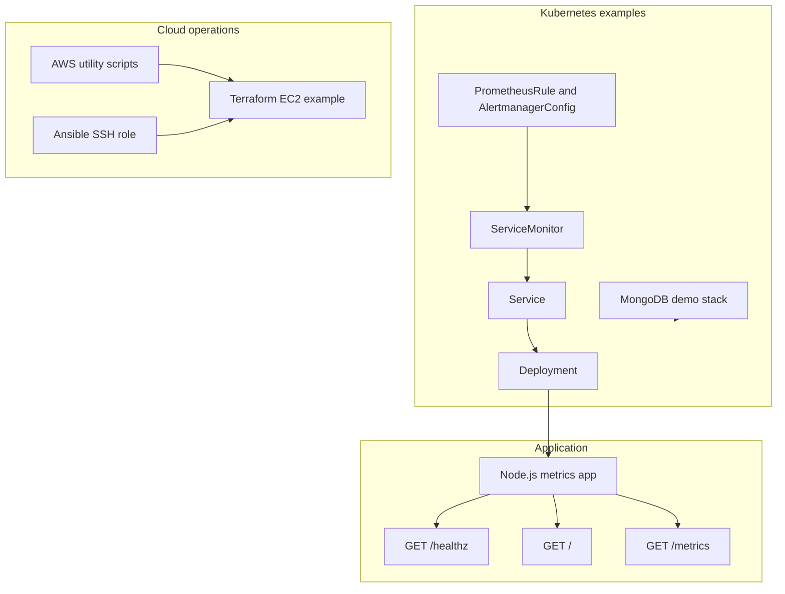
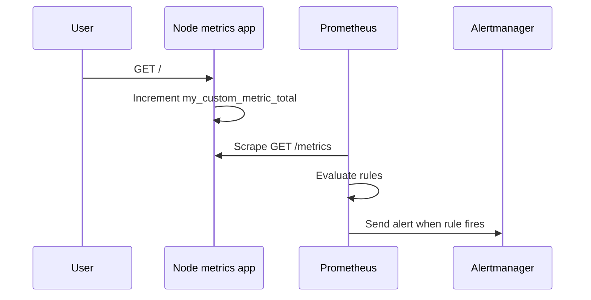
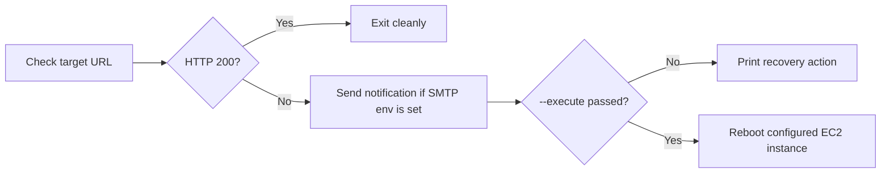

# Architecture

This repository demonstrates a small self-healing cloud operations pattern. It combines an observable app, Kubernetes deployment examples, infrastructure validation, and dry-run recovery utilities.

It is intentionally scoped as a portfolio project. The repo shows the control points an SRE or cloud engineer would build around a service, but it does not provision a full production platform.

## Component View

## Observability Flow

The app exposes default process metrics and a custom counter. Kubernetes manifests wire this through a named service port so Prometheus Operator can discover it with a `ServiceMonitor`.

## Deployment Paths

| Path | What it proves | Boundary |
| --- | --- | --- |
| Standalone manifests | Kubernetes resource authoring and hardening basics | Not a full environment overlay system |
| Helm chart | Repeatable rendering of the MongoDB demo stack | No chart repository release process |
| Terraform | Provider pinning, variables, outputs, and validation | No VPC, EKS, IAM, or remote state design |
| Ansible | Host hardening role shape | Inventory is intentionally inactive by default |
| Python scripts | Recovery and cleanup automation patterns | Live mutation requires explicit `--execute` |

## Recovery Utility Flow

The recovery script is deliberately conservative. It requires explicit configuration for the monitored URL and recovery instance, and it will not reboot an instance unless `--execute` is provided.

## Trust Boundaries

- Kubernetes Secret manifests contain placeholder values only.
- `.env.example` contains placeholders only.
- AWS scripts read configuration from CLI flags or environment variables.
- Terraform uses variables for region, AMI, instance type, and tags.
- No real cloud account layout is assumed.

## Production Gaps

To make this architecture production-grade, add persistent storage, external secret management, network policies, workload identity, remote Terraform state, scoped IAM, live cluster tests, and an incident-response integration path.
